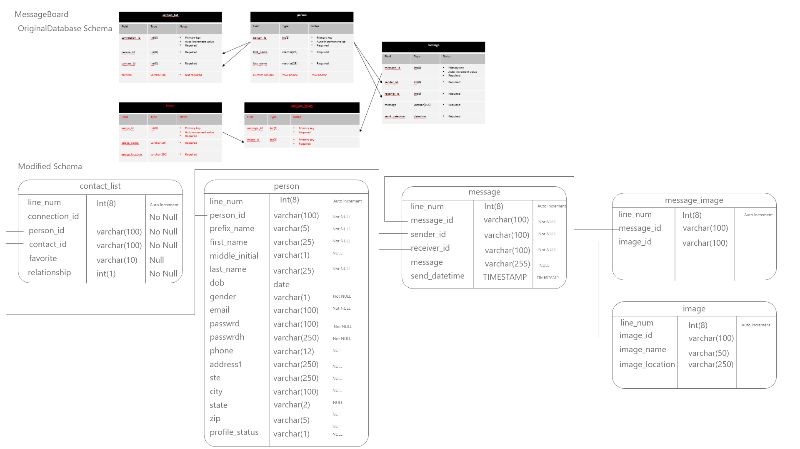
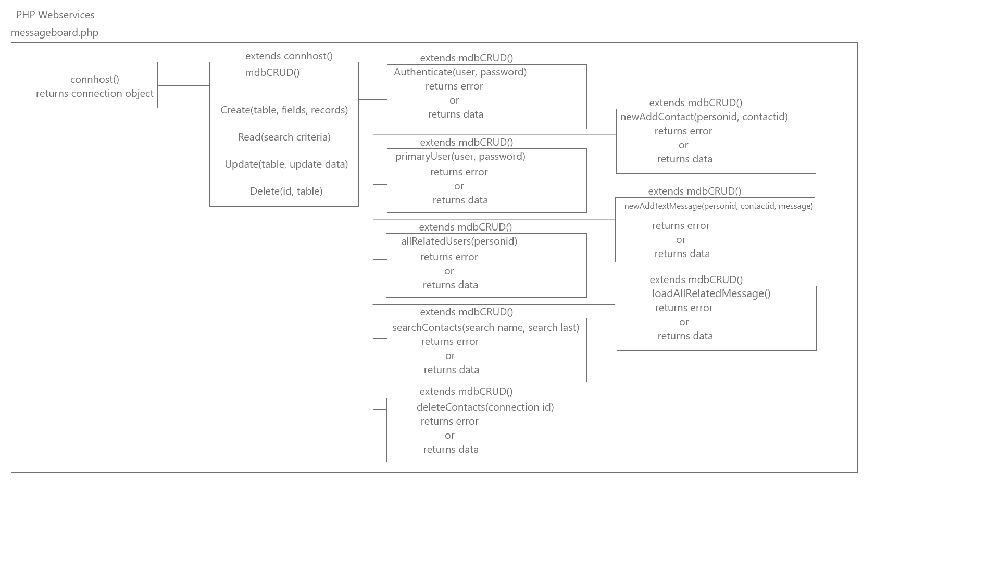
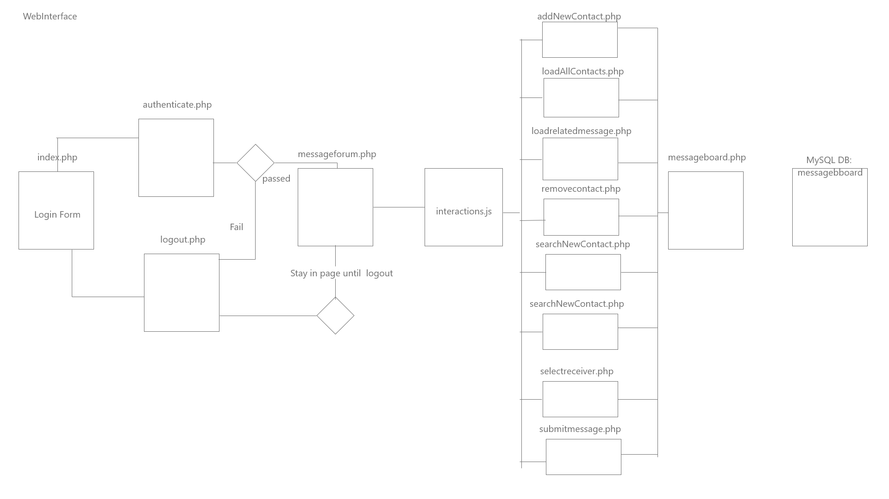
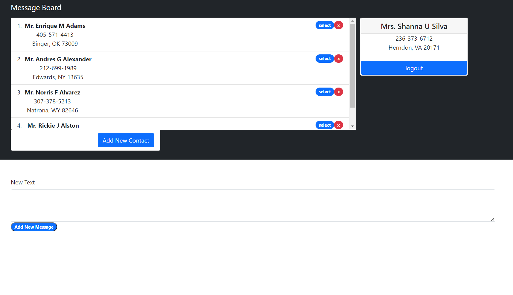
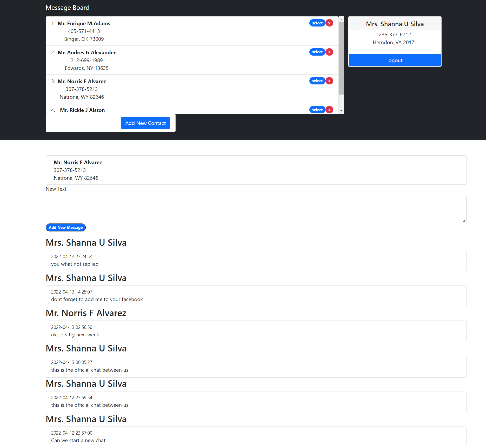

## Code Showcase

### There are three artifacts that has played an important role in my education at SNHU.

First lets start with  a code review of this Artifacts:

## Artifact I
### Code Review
Code Review

  <video src="CapstoneProject_final-0.mp4" controls="controls" class="d-block rounded-bottom-2 width-fit" style="max-height:800px;">

  </video>

  <video src="CapstoneProject_final-0b.mp4" controls="controls" class="d-block rounded-bottom-2 width-fit" style="max-height:800px;">

  </video>
  
In the course 330 Client Server, there were two final projects in the first Final Project the main objective was to create a CRUD file that would interact with a Mongo DB. Mongo DB is a no SQL database system. It is one of the new trends in technology that many companies are using to improve on the speed and create scalability to a higher level. In a typical relational database system, there are some drawbacks that hinder some of its scalability and development of complex database systems. For instance, relational database the records in a table must conform to having all the fields, if the record needs additional characteristics, you must add them to the table schema, whereas in Mongo DB the table is considered a collection of documents, the record is a Document, and each field or characteristic can be slightly different from one document to another. Simply put, the document could have a field or more different from another document and they can coexist in the same collection. In the relational model the fields of a record must exist for all the records. Moreover, related data in the traditional relational model must be organized in different table, in Mongo the document has all the related tables in the same document, and they could be queried just as well. In Mongo DB the documents are stored in Json style object such as: 
```json
{ “docid”:123,
	   “firstname”:”Oscar”,
   “lastname”:”Lopez”,
   “address”:[
	           {  “type”:”Billing”,
		“street”:”18900 West Park Drive”,
		“street2”:”Suite 4104”,
		“city”:”Miami”,
		“state”:”FL”,
		“zip”:”33189”
	           },
	           {  “type”:”Billing”,
		“street”:”18900 West Park Drive”,
		“street2”:”Suite 4104”,
		“city”:”Miami”,
		“state”:”FL”,
		“zip”:”33189”
	           }
	],
       “phone”:”786-331-7897”
}
```
Once the CRUD Class was finalized, the class was used to build a tool that would allow rescue animal trainers to connect to a national database of animal from shelters all over the USA so that they can locate animals that can be trained for the purpose of performing search and rescue operations. The rescue operations could be in any terrain and location. To enhance this artifact, I have created a class that admin users can create new users for their location. The admin users will be able to create users and modify the status of their users to inactive or delete users.
The class is simple but adds a great functionality, by allowing each location to manage their own list of users.


## Artifact II
Code Review

  <video src="CapstoneProject_final-1.mp4" controls="controls" class="d-block rounded-bottom-2 width-fit" style="max-height:800px;">

  </video>

In the course 330 Client Server, the second final project was to deploy a web interface to the back-end mongo database. The interface was develop using Dash from plotly. Dash is a framework that helps deploy fast web applications using very little code. The framework allows for fast deployment and easy to navigate. Further, it has many built in libraries that makes prototyping an excellent tool. Combine with Jupyter Notebook, makes conceptual applications into real testable interfaces.

In this improvement we are going to take the backend and use the Django framework to recreate the application again. We are going load the elements needed to query the Mongo DB to search for the types of dogs that can be used for search and rescue. Second we are going to load a map reflecting the different coordinate points for each document.


##### Download project here
https://oscarlopez01.github.io/myOnlinePortfolio/cs340_improve.zip

## Artifact III
Code Review

  <video src="CapstoneProject_final-2.mp4" controls="controls" class="d-block rounded-bottom-2 width-fit" style="max-height:800px;">

  </video>
  
The Course DAD220 was fundamental in teaching relational database system using SQL, in this case it was MySQL one of the most used SQL server on the internet.  The final project was to answer a series of question that would reflect the handling of an SQL server and knowing the commands to administer that server. In this case the course presented us with a Database that allowed for users to message with contacts met. The course gave us the basic structure, it was up to each one to extend the structure by adding fields and functionality that each one thought necessary. The course was instrumental in teaching us how to create a database, create users, give users the ability different access, create tables, insert record, modified records, delete record, and lookup records, all this is better known as CRUD. Next, one major aspect was learning how to execute queries, queries that calculate different aspect of the datasets, queries that return group data, sorted data, and limits of sets.

The graphic shows the database schema for the final project and how the schema was updated. In addition, there are several steps that will be performed to get the data ready for the new schema and ready to deploy. 

First, the schema was updated using a SQL file, which is often used to create backups of the database. At the same time it is used to add records to the main tables, and move data between databases. Second, create an empty database. Third, run the SQL file to create the tables and lastly import the main dataset into the person table. Once the data is up and running, a php script was created to encode the current password using a php function called password_hash which will update the passwrodh field with the encoded password. One this step is performed the application is ready for deployment.
 
 
Now, let’s discuss the php application. First, develop a class that connects to a database, second create a CRUD class that extends the database connector. Third created a class for authentication purpose, fourth created a class that returns the primary user which is the user currently logged in. From there on I create a class that extends the CRUD using specific parts of the CRUD to service the web interface.
 




As soon as the person logins their contacts will load, a search allows to search for contacts and add that person to the contact list. To send a message, first you need to click on a contact select button and from there the system loads the user to send a message to. The user now can enter a message and click send to submit the message.
 


 



Once done, the user can now click the logout button.

